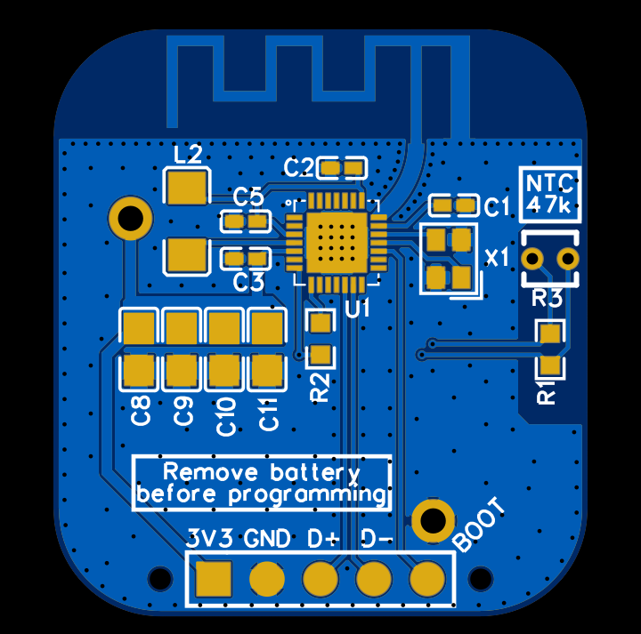

# CH58X-BTHome
BLE Temperature Sensor using the [BTHome](https://github.com/Bluetooth-Devices/bthome-ble/) protocol on the [CH58X](https://github.com/openwch/ch583/) ic series.

## Basic configuration
The default intervals and encryption key can be changed in `src/sensor.cpp`

The default hardware configuration is:
```
GND -- R0 [10k] -- GPIO A4 -- NTC [50k, B=3950] -- GPIO A12
```

## Building
The toolpath can be set in `CMakeLists.txt`. The toolset can be downloaded from the [Mounriver website](http://www.mounriver.com/), though the [xpack](https://github.com/xpack-dev-tools/riscv-none-embed-gcc-xpack) distribution most likely works as well (untested).
```
mkdir build
cd build
cmake ..
make
```

## Board
The schematic and gerber files for the PCB are located in the `Board` folder. 

